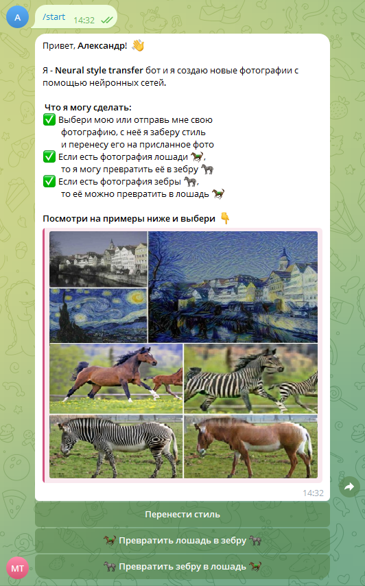
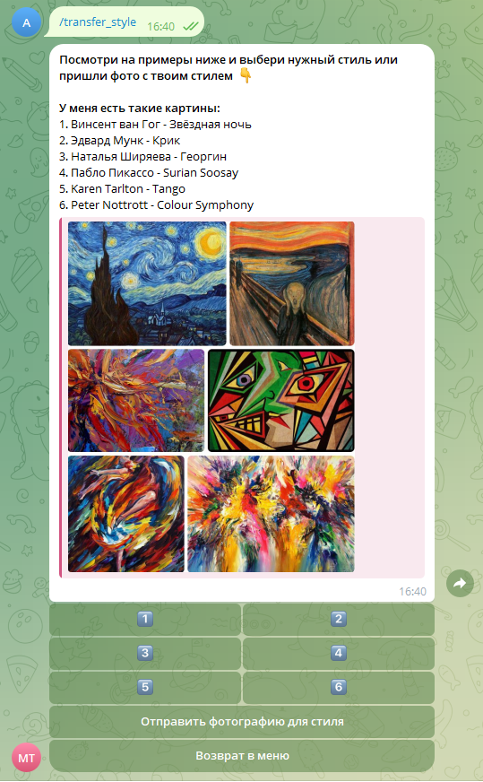
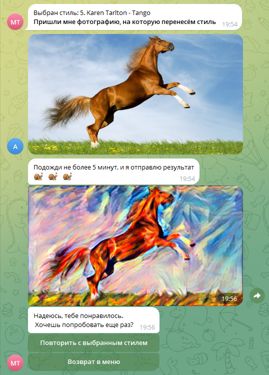
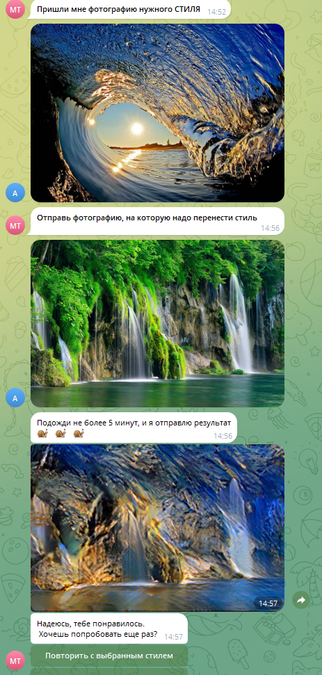
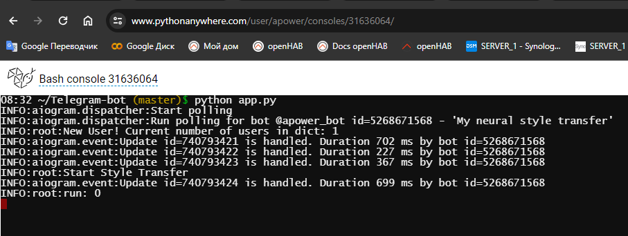
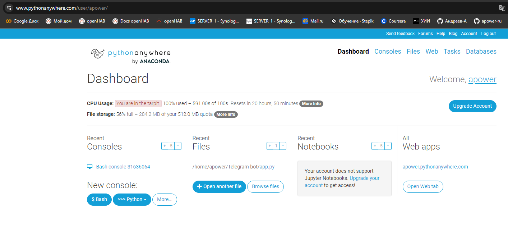

## <p align="center">Телеграм бот</p>
### <p align="center">Aiogram StyleTransfer CycleGAN Webhook</p>



## Telegram Bot
Это - Neural style transfer бот. Он умеет создавать новые фотографии с помощью нейронных сетей,
используя классический алгоритм Гатиса на базе предобученной VGG19 или используя CycleGAN.
Для написания бота использовалась библиотека aiogram 3 для построения асинхронной архитектуры.
Весь код в файле _app.py_.
<br><br><br><br><br><br><br><br><br><br><br><br><br><br><br><br><br>

Функционал бота:  
1. Перенос стиля
   * Для начала необходимо отправить боту фотографию стиля, а затем фотографию, на которую необходимо перенести стиль.
   * Есть возможность выбрать картинку стиля у бота. Предлагается на выбор 6 разных картин художников.  




2. Использовать CycleGAN
    * Превратить лошадь в зебру
    * Превратить зебру в лошадь  
    
   

3. Бот может отправить примеры, получаемые в результате работы трёх вышеназванных алгоритмов  

__Особенности работы__:  
1. Запоминание пользователей и отправляемых ими фотографий стиля реализовано через словарь. В нём хранится id пользователя, название выбранного алгоритма и в случае использования style transfer сохраняется фотография стиля. Фотография, на которую переносится стиль, передаётся сразу в пайплайн выбранного алгоритма.  
2. Бот отдает фотографию в том же разрешении, что и получил от пользователя. Так как для моделей необходимы квадратные фотографии, то используются паддинги
   * StyleTranfer: сжатие до 250 пикселей. Увеличение показателя улучшает получаемое качество, однако, увеличивает время получения ответа.
   * CycleGAN: сжатие до 512 пикселей
3. Алгоритмы запускаются в отдельном потоке с помощью threading.Thread
4. Длительность работы:
   * StyleTrasfer: в среднем 2 минуты
   * CycleGAN: в среднем 10 секунд

## StyleTransfer
Для переноса стилей было сделано следующее:
1. Взята предобученная модель VGG19 с весами ImageNet
2. Модель была дополнительно доучена на датасете Caltech 101, содержащем 9144 изображений в 102 категориях данных. Код обучения представлен в файле _model_nst/train_vgg19.ipynb_
3. Из обученной модели сохранены веса только нужных слоев (первые одиннадцать) в файл _models_wts/vgg19.pth_. При обучении использовались алгоритмы семплирования и аугментации исходных изображений. Подобранное количество эпох и других мета-параметров позволило добиться хорошей "сходимости" модели
4. Для переноса стилей использован классический алгоритм Гатиса, который подразумевает итеративное изменение входной картинки на основе разницы между style и content картинками
5. Дообучение модели осуществлено в Google Colab на GPU (Tesla T4)

## CycleGAN
Для использования CycleGAN был взят код junyanz [pytorch-CycleGAN-and-pix2pix](https://github.com/junyanz/pytorch-CycleGAN-and-pix2pix)
Исходный код дает возможность использовать CycleGAN и pix2pix моделей в различных режимах на различных датасетах

Для использования такого большого проекта для этой работы были сделано следующее:
1. Взята архитектура только CycleGAN в режиме для теста, чтобы генерировать изображения только в одну сторону (папка _models_) 
    * Переделан вход модели так, чтобы она принимала не датасет, а отдельное изображение
    * Модель сразу отдает результат генерации, а не пускает его дальше по пайплайну
    * Убраны лишние функции
2. Пред и пост обработка фотографий выполнена собственными функциями
3. Взяты параметры для запуска скрипта в тестовом режиме (папка _options_)
4. Был переделан скрипт test.py так, чтобы он создавал модель со стандартными параметрами и сохранял ее полностью в файлы pth для дальнейшего использования ботом.

## Deployment
Первоначально бот был задеплоен на pythonanywhere.com. Но бесплатное развертывание гарантирует 100 с работы с максимальным использование процессора в сутки. Что в моем случае хватило на обработку одной картинки - далее уходит порядка 20-40 минут на одну обработку (по мере свободности ресурсов сервера).




По этой причине на данный момент времени бот развернут на компьютере [Nvidia Jetson Nano](https://developer.nvidia.com/embedded/jetson-nano-developer-kit) под управлением Ubuntu 20.3, который позволяет создавать автономные аппаратные системы, работающие на моделях глубокого обучения с GPU-ускорением.

Для работы бота в режиме __webhook__ необходимо туннелирование localhost-а, так как нет внешнего статического IP-адреса. Эта задача решена с использованием платформы ngrok, которая объединяет обратный прокси-сервер, брандмауэр, шлюз API и глобальную балансировку нагрузки для доставки приложений и API. Использование постоянного адреса подключения является желательным для повышения автономности работы бота. Данный функционал в случае с ngrok является платным. Для решения этой проблемы был написан bash скрипт, который при старте сервера запрашивает по API новый 'public_url' на ngrok и автоматически запускает бота с новыми данными.
 
Настройки телеграм бота, в том числе, его токен и параметры для __webhook__ хранятся в файле .env (нет в репозитарии)

## requirements.txt
Все вычисления происходят на GPU. Перечень основных пакетов и их версии:
```
python==3.8.10
aiogram==3.3.0
Pillow==10.2.0
torch==1.13.0
torchvision==0.14.0
```

## Структура репозитория
| | | Описание файлов и папок |
| --- | --- | --- |
| Images | | |
|  | Examples | Примеры работы модели |
|  | Styles | Варианты картинок для стиля |
| model_cyclegan | | |
|  | checkpoints | Веса, используемые для создания СycleGAN |
|  | models | Архитектура СycleGAN |
|  | options | Параметры для создания СycleGAN |
|  | scripts | Внутри скрипт для загрузки весов CycleGAN |
|  | CycleGAN.py | Пайплайн для СycleGAN |
|  | test.py | Скрипт для создания моделей с загруженными весами|
| model_nst | | |
|  | StyleTransfer.py | Модель и пайплайн для StyleTransfer |
|  | train_vgg19.py | Дообучение модели VGG19 |
| models_wts | | Веса для всех моделей |
| scr | | шаблон fastAPI |
|  | filters | Фильтры |
|  | handlers | Обработчики |
|  | middlewares | Промежуточное ПО |
|  | config.py | Загрузка данных доступа|
| app.py | | Код телеграм бота |
| requirements.txt | | Необходимые пакеты |
